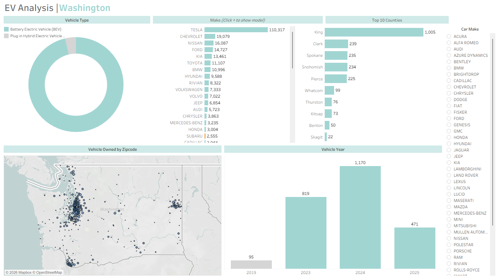

# EV Market Analysis (Washington State)

## Overview

This project analyzes electric vehicle (EV) adoption trends using publicly available data from data.gov.

The objective is to explore how EV adoption has evolved over time, identify dominant manufacturers, and understand geographic distribution patterns across Washington State.

The analysis focuses on transforming raw registration data into actionable insights through data exploration and visualization.

## Data Workflow

1. **Data Source**  
   The dataset was obtained from data.gov and contains electric vehicle registration records across Washington State.

2. **Data Preparation (Excel)**  
   - Cleaned and formatted raw CSV data  
   - Standardized column formats  
   - Removed inconsistencies and prepared fields for analysis  

3. **Data Analysis & Visualization (Tableau)**  
   - Aggregated vehicle counts by make, model, and year  
   - Analyzed geographic distribution by county  
   - Built interactive dashboards to explore adoption trends  

## Data Preview

The dataset includes information such as:

- Vehicle make and model  
- Model year  
- County / geographic location  
- Electric vehicle type (BEV / PHEV)  

## Dashboard Preview

The Tableau dashboard visualizes EV adoption patterns across multiple dimensions.

## Key Insights

- EV adoption has increased significantly in recent years, with strong growth in newer model years  
- A small number of manufacturers (e.g., Tesla) dominate the market share  
- Adoption is concentrated in certain counties, indicating regional differences in EV penetration  
- Battery Electric Vehicles (BEVs) make up a larger share compared to Plug-in Hybrid Electric Vehicles (PHEVs)  

## Tools & Technologies

- Tableau  
- Excel  

## Notes

This project uses publicly available data from data.gov.  
The dataset has been simplified for demonstration purposes.

## Project Impact

This analysis provides a structured view of EV market trends, helping identify growth patterns, regional adoption differences, and key market players.

The dashboard enables stakeholders to explore EV adoption interactively and supports data-driven insights into the evolving electric vehicle landscape.

## Repository Structure
