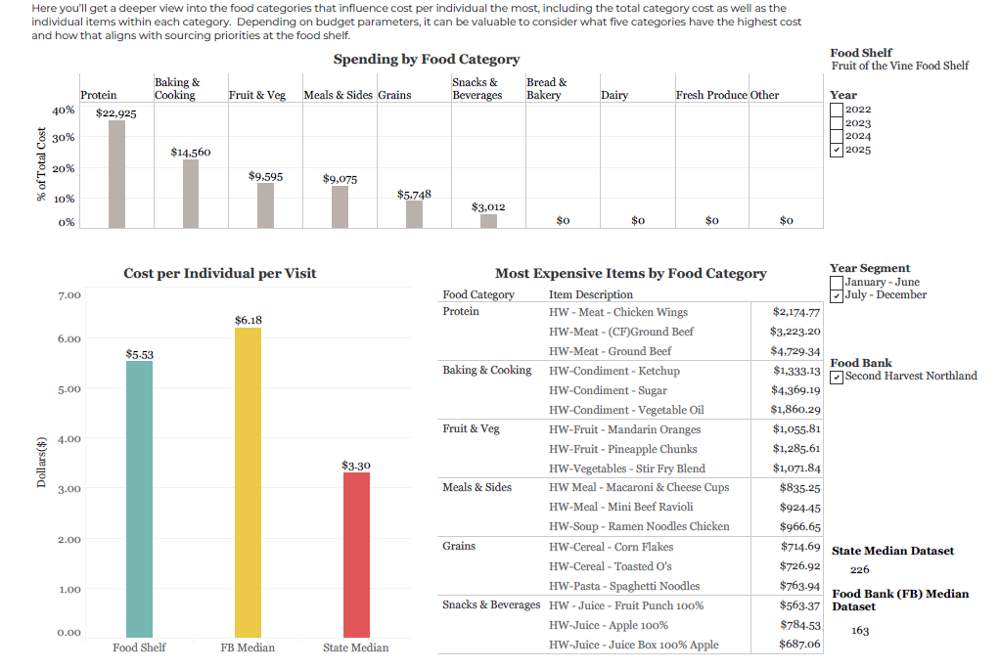

# Food Supply Gap Analysis
## Overview
This project analyzes statewide food distribution data to identify supply-demand imbalances across food shelves.

The analysis was developed during my data analytics internship with a nonprofit organization supporting food distribution programs across Minnesota.

The objective was to help partners better understand inventory distribution patterns and identify categories experiencing shortages.

## Dashboard Preview

## Dataset
The dataset includes food inventory and distribution records collected from 230+ food shelves across **Minnesota**.

The records include information such as:

Food category

Inventory quantities

Distribution metrics

Regional service areas

Due to data confidentiality, the dataset in this repository is a simplified sample version that preserves the structure used in the analysis.

## Analysis Workflow

The analysis involved several steps:

**1. Data Cleaning**

Python scripts were used to standardize food shelf records and correct formatting issues such as trailing spaces and inconsistent naming conventions.

**2. SQL Analysis**

SQL queries were executed in AWS Athena to aggregate distribution metrics and identify patterns across regions and food categories.

**3. Automation**

A rule-based Python automation tool was developed to standardize reporting workflows, reducing preparation time from 2 days to approximately 3 hours.

**4. Visualization**

Tableau dashboards were created to visualize food supply imbalances and benchmark food shelves against statewide averages.

## Key Insights

- Certain food categories, particularly proteins, showed significant supply gaps across multiple regions.

- Rural areas often experienced lower supply levels compared with urban service areas.

- Data visualization enabled partners to benchmark performance against statewide metrics.

## Tools Used

Python

SQL (AWS Athena)

Tableau
