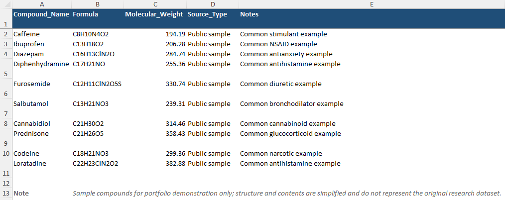
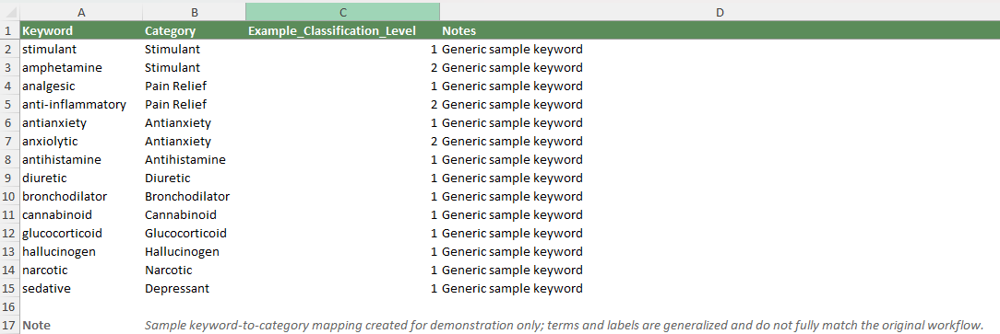
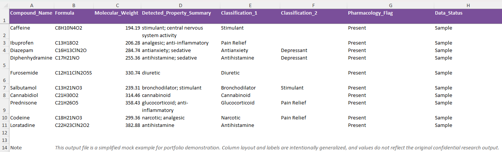

# Pharmacology Data Pipeline

## Overview

This project builds an automated data pipeline to extract, standardize, and classify pharmacological properties of chemical compounds from PubChem.

The objective was to replace manual compound lookup and classification with a scalable process that produces structured data for downstream analysis.

The pipeline combines web scraping, data cleaning, and rule-based classification to transform unstructured web data into an analysis-ready dataset.

## Data Workflow

This project follows a structured data pipeline:

1. **Data Input**  
   A list of chemical compounds is provided in Excel format.

2. **Data Extraction (Python + Selenium)**  
   Compound records are retrieved from PubChem by searching compound names and navigating result pages.

3. **Data Cleaning & Standardization**  
   - Handles inconsistent naming and formatting  
   - Applies normalization to improve matching accuracy  
   - Implements fallback logic for ambiguous or partial matches  

4. **Feature Extraction**  
   Relevant pharmacological information is extracted from page content, including:
   - Pharmacological properties  
   - Pharmacodynamics descriptions  
   - MeSH pharmacological classifications  
   - ATC codes  

5. **Rule-Based Classification**  
   Extracted text is mapped to standardized categories using a keyword-based classification table.

6. **Structured Output**  
   The processed data is exported to Excel for further analysis and reporting.

## Data Preview

The following examples illustrate how raw input data is transformed into structured output through the pipeline.

### Input Data (Sample Compounds)

The input dataset contains a list of chemical compounds used for extraction.

### Keyword Classification Mapping

A keyword-based lookup table is used to map extracted pharmacological text to standardized categories.

### Output Dataset

The final output dataset contains extracted pharmacological properties and their assigned classification labels, enabling structured downstream analysis.

## Key Contributions

• Built an end-to-end pipeline to convert unstructured web data into structured datasets  
• Automated compound lookup and classification, significantly reducing manual processing time  
• Designed rule-based classification logic using keyword mapping  
• Improved data consistency through normalization and matching strategies  
• Generated analysis-ready data for downstream use in research and reporting  

## Example Output

The final dataset includes:

- Compound name  
- Detected pharmacological properties  
- Classification labels  
- Additional metadata (e.g., ATC codes, pharmacodynamics)  

*(See [`outputs/`](outputs/) folder for sample results)*

## Tools & Technologies

- Python  
- Selenium  
- BeautifulSoup  
- Pandas  
- Excel  

## Notes

All datasets included in this repository are simplified and anonymized samples created for demonstration purposes.  

To protect confidential research data, the structure, field names, and outputs have been generalized and do not fully reflect the original project environment.

The Python scripts are adapted to illustrate the data processing workflow and may require modification to run with the sample files provided in this repository.

## Project Impact

This pipeline transformed a manual, time-intensive process into an automated workflow.

Manual compound lookup and classification that previously required extensive effort can now be completed efficiently, enabling faster and more consistent data preparation for analysis.

## Repository Structure
scripts/ → data extraction and processing scripts

inputs/ → sample input datasets

outputs/ → processed data samples

images/ → screenshots used for visualization in README
